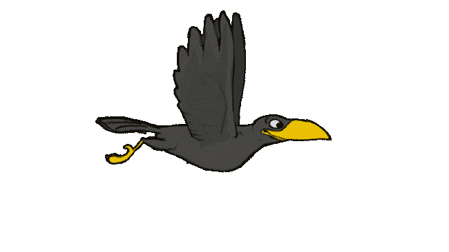

# 🌍 Earth's Story - A Sustainable Future

An immersive, anime-inspired multimedia experience that tells Earth's sustainability story through 11 cinematic slides with synchronized audio narration. Built with pure HTML, CSS, and vanilla JavaScript, featuring Adobe Firefly-generated backgrounds and custom audio tracks.

## ✨ Core Features

### 🎵 Immersive Audio Experience

- **Background Music** - Continuous soundtrack throughout the journey
- **Slide Narration** - 11 unique audio tracks synchronized with each slide
- **Audio Controls** - Interactive control panel(top left) with:
  - Background music toggle
  - Slide audio toggle
  - Volume slider with independent control
  - Hide/show controls option
  - Smooth fade in/out transitions

### 🎨 Top Visual Experience

- **11 Anime-Inspired Backgrounds** - Created with Adobe Firefly AI (my fav goto)
- **Animated Wildlife** - Flying birds(gif) with varied speeds and paths
- **Moving Grass Animation** - Grass(gif) Dynamic foreground elements
- **Custom Cursor** - Glowing, interactive cursor effect
- **Parallax Scrolling** - Multi-layer depth perception
- **Cinematic Typography** - Neon glow effects with Orbitron font

### 🎮 Interactive Navigation

- **Scroll Snap** - Smooth, mandatory vertical slide transitions
- **Navigation Dots** - Visual progress indicator with active state
- **Keyboard Support** - Arrow keys, spacebar, Home/End navigation
- **Touch Gestures** - Mobile swipe support
- **Smooth Scrolling** - Custom easing for cinematic flow
- **Auto-hide Scroll Indicator(at the bottom of the screen)** - Smart UI that disappears after interaction

## 📁 Project Structure

```
earth-story/
│
├── index.html              # Main HTML structure
├── style.css              # Styles and animations
├── script.js              # Interactive functionality
├── README.md              # Documentation
│
├── Images/                # Visual assets
│   ├── image1.1.jpg      # Slide 1 - Earth's beginning
│   ├── image2.jpg        # Slide 2 - Life in balance
│   ├── image3.jpg        # Slide 3 - Environmental change
│   ├── image4.jpg        # Slide 4 - Earth's crisis
│   ├── image5.jpg        # Slide 5 - Deaf to cries
│   ├── image6.jpg        # Slide 6 - Hope begins
│   ├── image7.png        # Slide 7 - Together we heal
│   ├── image8.jpg        # Slide 8 - Earth breathes
│   ├── image9.jpg        # Slide 9 - Tomorrow together
│   ├── image10.1.jpg     # Slide 10 - It begins with you
│   ├── image11.jpg       # Slide 11 - Thank you
│   ├── bird.gif          # Animated bird sprite
│   └── movinggrass.gif   # Animated grass element
│
└── music/                 # Audio assets
    ├── musicbg.mp3       # Background music loop
    ├── audio1.mp3        # Slide 1 narration
    ├── audio2.mp3        # Slide 2 narration
    ├── audio3.mp3        # Slide 3 narration
    ├── audio4.mp3        # Slide 4 narration
    ├── audio5.mp3        # Slide 5 narration
    ├── audio6.mp3        # Slide 6 narration
    ├── audio7.mp3        # Slide 7 narration
    ├── audio8.mp3        # Slide 8 narration
    ├── audio9.mp3        # Slide 9 narration
    ├── audio10.mp3       # Slide 10 narration
    └── audio11.mp3       # Slide 11 narration
```

## 🚀 Quick Start

### Installation

1. Clone or download the project
2. Ensure all image and audio files are in their respective folders
3. Open `index.html` in a modern web browser

### Local Development

```bash
# Python 3
python -m http.server 8000

# Node.js
npx serve .

# Live Server (VS Code)
# Right-click index.html → "Open with Live Server"
```

## 🎛️ Audio Controls Guide

### Control Panel Features

- **🎵 Button** - Toggle background music on/off
- **🔊 Button** - Toggle slide narration on/off
- **Volume Slider** - Adjust overall volume (background music plays at 30% of slider value)
- **✖ Button** - Hide/show the entire control panel

### Audio Behavior

- Audio starts on first user interaction (click, scroll, or keypress)
- Background music loops continuously
- Slide audio changes automatically with navigation
- Smooth fade transitions between audio tracks

## 🎨 Customization Guide

- For friends who downloaded my codes and want to use their own images or make other customisations!! :D

### Replacing Images

1. Add your images to the `Images/` folder
2. Update paths in `index.html`:

```html
<div
  class="parallax-bg"
  style="background-image: url('./Images/your-image.jpg')"
></div>
```

### Updating Audio

1. Place audio files in the `music/` folder
2. Update audio elements in `index.html`:

```html
<audio id="audio-1" class="slide-audio">
  <source src="./music/your-audio.mp3" type="audio/mpeg" />
</audio>
```

### Modifying Text

Edit slide content in `index.html`:

```html
<h1 class="slide-title">Your Title</h1>
<p class="slide-text">Your subtitle text</p>
```

### Adjusting Animation Timing

Modify animation delays in `style.css`:

```css
.slide-title.animate-in {
  animation-delay: 0.6s; /* Adjust title entrance timing */
}
.slide-text.animate-in {
  animation-delay: 2s; /* Adjust text entrance timing */
}
```

## 🐦 Animated Elements

### Birds Configuration

- **Slides with birds**: 1, 2, 4, 5
- **Bird count per slide**: 3-5 birds
- **Animation duration**: 18-25 seconds per cycle
- **Flight path**: Left to right across screen

### Adding/Removing Birds

In `index.html`, add bird elements to any slide:

```html

```

Then position in `style.css`:

```css
#bird-{slide}-{number} {
  top: 15%; /* Vertical position */
  animation-duration: 20s; /* Flight speed */
}
```

## 🔧 Technical Details

### Browser Compatibility

- Chrome 60+ ✅
- Firefox 55+ ✅
- Safari 12+ ✅
- Edge 79+ ✅
- Mobile browsers ✅

### Performance Features

- Intersection Observer for efficient animations
- Will-change CSS property for GPU acceleration
- Debounced scroll events
- Optimized animation frame requests
- Lazy-loaded animations (only when visible)

### Responsive Breakpoints

- Desktop: Full experience with custom cursor
- Tablet (≤768px): Adjusted controls, hidden cursor
- Mobile (≤480px): Vertical audio controls, smaller text

## 📱 Mobile Experience

### Touch Gestures

- **Swipe Up** - Next slide
- **Swipe Down** - Previous slide
- **Tap Navigation Dots** - Jump to specific slide

### Mobile Optimizations

- Custom cursor disabled
- Simplified audio controls
- Responsive typography scaling
- Optimized animations for performance

## 🎯 Keyboard Shortcuts

- **↓ / →** / **Space** - Next slide
- **↑ / ←** - Previous slide
- **Home** - First slide
- **End** - Last slide

## 🛠️ Troubleshooting

### Audio Not Playing?

- Ensure audio files are in `music/` folder
- Check file names match HTML references
- Try interacting with the page first (browser autoplay policy)
- Verify audio format is MP3

### Images Not Loading?

- Check image paths in HTML
- Ensure images are in `Images/` folder
- Verify file extensions (.jpg, .png, .gif)

### Animations Stuttering?

- Close other browser tabs
- Check GPU acceleration is enabled
- Try reducing animation complexity on older devices

## 🌱 Environmental Message

This project aims to inspire environmental consciousness through immersive storytelling. Each slide represents a chapter in Earth's story - from pristine beginnings through crisis to hope and renewal. The message is clear: sustainability begins with individual action but requires collective effort.

## 🤝 Credits

- **Visuals**: Adobe Firefly AI-generated anime backgrounds
- **Typography**: Google Fonts (Orbitron, Quicksand)
- **Concept**: Environmental sustainability awareness
- **Development**: Pure vanilla web technologies

Note: this was generated and formatted by AI for ease of reading by friends and hackathon judges :)

---

**"Sustainability is love for all life. Let your actions today shape the world of tomorrow!"** 🌍✨
